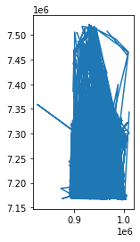

## Problem 3: How long distance individuals have travelled? 

In this problem the aim is to calculate the "distance" in meters that the individuals have travelled according the social media posts (Euclidean distances between points). In this problem, we will need the `userid` -column an the points created in the previous problem. You will need the shapefile `Kruger_posts.shp` generated in Problem 2 as input file.

Our goal is to answer these questions based on the input data:
- What was the shortest distance travelled in meters?
- What was the mean distance travelled in meters?
- What was the maximum distance travelled in meters?

**In your code, you should first:**
 - Import required modules.
 - Read in the shapefile as a geodataframe called `data`
 - Reproject the data from WGS84 projection into `EPSG:32735` -projection which stands for UTM Zone 35S (UTM zone for South Africa) to transform the data into metric system.
 
*Store the result in a variable called `data`*!


```python
# YOUR CODE HERE 1 to read data
import geopandas as gpd
from pyproj import CRS
#world.to_crs("EPSG:3395") 
fp="Kruger_posts.shp"
data=gpd.read_file(fp)
#raise NotImplementedError()
```

- Check the crs of the input data. If this information is missing, set it as epsg:4326 (WGS84).
- Reproject the data from WGS84 to `EPSG:32735` -projection which stands for UTM Zone 35S (UTM zone for South Africa) to transform the data into metric system. (don't create a new variable, update the existing variable `data`!)"


```python
# YOUR CODE HERE 2 to set crs
print(data.crs)
data=data.to_crs("EPSG:32735")
data.crs
```

    epsg:4326


    <Projected CRS: EPSG:32735>
    Name: WGS 84 / UTM zone 35S
    Axis Info [cartesian]:
    - E[east]: Easting (metre)
    - N[north]: Northing (metre)
    Area of Use:
    - name: World - S hemisphere - 24°E to 30°E - by country
    - bounds: (24.0, -80.0, 30.0, 0.0)
    Coordinate Operation:
    - name: UTM zone 35S
    - method: Transverse Mercator
    Datum: World Geodetic System 1984
    - Ellipsoid: WGS 84
    - Prime Meridian: Greenwich


```python
# NON-EDITABLE CODE CELL FOR TESTING YOUR SOLUTION

# Check the data
print(data.head())
```

             lat        lon         timestamp    userid  \
    0 -24.980792  31.484633  2015-07-07 03:02  66487960   
    1 -25.499225  31.508906  2015-07-07 03:18  65281761   
    2 -24.342578  30.930866  2015-03-07 03:38  90916112   
    3 -24.854614  31.519718  2015-10-07 05:04  37959089   
    4 -24.921069  31.520836  2015-10-07 05:19  27793716   
    
                             geometry  
    0  POINT (952912.890 7229683.258)  
    1  POINT (953433.223 7172080.632)  
    2  POINT (898955.144 7302197.408)  
    3  POINT (956927.218 7243564.942)  
    4  POINT (956794.955 7236187.926)  


```python
# NON-EDITABLE CODE CELL FOR TESTING YOUR SOLUTION

# Check that the crs is correct after re-projecting (should be epsg:32735)
print(data.crs)
```

    EPSG:32735


 - Group the data by userid


```python
#  YOUR CODE HERE 3 to group 
#raise NotImplementedError()
grouped=data.groupby('userid')

```


```python
# NON-EDITABLE CODE CELL FOR TESTING YOUR SOLUTION

#Check the number of groups:
assert len(grouped.groups) == data["userid"].nunique(), "Number of groups should match number of unique users!"
```

**Create LineString objects for each user connecting the points from oldest to latest:**

*Suggested steps:*
- Create an empty DataFrame called `movements`. 
- Create an empty column "geometry"
- Use a for-loop where you iterate over the grouped object. For each user's data: 
    - [sort](http://pandas.pydata.org/pandas-docs/stable/generated/pandas.DataFrame.sort_values.html) the rows by timestamp 
    - create a LineString object based on the user's points
    - Add the LineString to the geometry column of the `movements` dataframe. You can also add the `userid` in a separate column (or use the userid as index).
- Convert `movements` into a `GeoDataFrame` (you can replace the DataFrame created in the previous steps with the GeoDataFrame). Remember to set the `geometry` column.
- Set the CRS of the ``movements`` GeoDataFrame as ``EPSG:32735`` 


```python
# YOUR CODE HERE 4 to set movements
#raise NotImplementedError()
import pandas as pd
from shapely.geometry import LineString, Point
movements=gpd.GeoDataFrame()
#movements['geometry']=pd.DataFrame(dtype=object)
movements['geometry']=gpd.GeoSeries(dtype=object)
#movements
count=0
for i,df in grouped:
    df=df.sort_values(by=['timestamp'])
#    print("i:",i,df)
#    geometry = [Point(xy) for xy in zip(df.lon, df.lat)]#
#    print("len:",len(geometry))
    if len(df['geometry'])>=2:
        line=(LineString(list(df['geometry'])))
    else:
        line=None
    
    movements.at[count,'userid']=i
    movements.at[count,'geometry']=line
    count=count+1
    
movements.crs = CRS.from_epsg(32735)

```


```python
# NON-EDITABLE CODE CELL FOR TESTING YOUR SOLUTION

#Check the result
print(type(movements))
print(movements.crs)
print(movements["geometry"].head())
```

    <class 'geopandas.geodataframe.GeoDataFrame'>
    epsg:32735
    0    LINESTRING (942231.630 7254606.868, 938934.725...
    1                                                 None
    2                                                 None
    3                                                 None
    4    LINESTRING (905394.500 7193375.148, 905394.500...
    Name: geometry, dtype: geometry


**Finally:**
- Check once more the crs definition of your dataframe (should be epsg:32735, define the correct crs if this information is missing)
- Calculate the lenghts of the lines into a new column called ``distance`` in ``movements`` GeoDataFrame.


```python
# YOUR CODE HERE 5 to calculate distance
print(movements.crs)
def cal_distance(x):
    if x['geometry'] is None:
        return None
    else:
        return x['geometry'].length
movements['distance'] = movements.apply(cal_distance, axis=1)
#移動距離の平均, 最大値, 最小値
#print(movements['distance'].mean()) #138871.14194459998
#print(max(movements['distance'].dropna())) #8457917.497356484
#print(min(movements['distance'])) #0.0
```

    epsg:32735


```python
# NON-EDITABLE CODE CELL FOR TESTING YOUR SOLUTION

#Check the output
movements.head()
```


<div>
<style scoped>
    .dataframe tbody tr th:only-of-type {
        vertical-align: middle;
    }

    .dataframe tbody tr th {
        vertical-align: top;
    }

    .dataframe thead th {
        text-align: right;
    }
</style>
<table border="1" class="dataframe">
  <thead>
    <tr style="text-align: right;">
      <th></th>
      <th>geometry</th>
      <th>userid</th>
      <th>distance</th>
    </tr>
  </thead>
  <tbody>
    <tr>
      <th>0</th>
      <td>LINESTRING (942231.630 7254606.868, 938934.725...</td>
      <td>16301.0</td>
      <td>328455.11543</td>
    </tr>
    <tr>
      <th>1</th>
      <td>None</td>
      <td>26589.0</td>
      <td>NaN</td>
    </tr>
    <tr>
      <th>2</th>
      <td>None</td>
      <td>29322.0</td>
      <td>NaN</td>
    </tr>
    <tr>
      <th>3</th>
      <td>None</td>
      <td>42181.0</td>
      <td>NaN</td>
    </tr>
    <tr>
      <th>4</th>
      <td>LINESTRING (905394.500 7193375.148, 905394.500...</td>
      <td>45136.0</td>
      <td>0.00000</td>
    </tr>
  </tbody>
</table>
</div>


You should now be able to print answers to the following questions: 

 - What was the shortest distance travelled in meters?
 - What was the mean distance travelled in meters?
 - What was the maximum distance travelled in meters?


```python
# YOUR CODE HERE 6 to find max, min,mean of the distance.
print(movements['distance'].mean()) #138871.14194459998
print(max(movements['distance'].dropna())) #8457917.497356484
print(min(movements['distance'])) #0.0
```

    107133.51202944407
    6970668.8163439585
    0.0


- Finally, save the movements of into a Shapefile called ``some_movements.shp``


```python
# YOUR CODE HERE 7 to save as Shapefile
outfp="some_movements.shp"
movements.to_file(outfp)
movements.plot()
```


    <matplotlib.axes._subplots.AxesSubplot at 0x7f8a108f4e80>


    

    


```python
# NON-EDITABLE CODE CELL FOR TESTING YOUR SOLUTION

import os

#Check if output file exists
assert os.path.isfile(fp), "Output file does not exits."
```

That's all for this week!


```python

```
